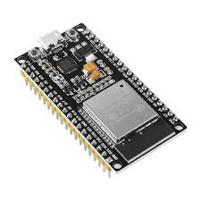
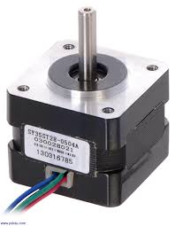

# Part List

Debes tener a la mano los siguientes **componentes**:

1. **ESP32**
2. **DRV8825 (x3)**
3. **Bipolar Stepper (x3)**

# Parts Specs

Especificaciones y comentarios referentes a los componentes del proyecto.

## ESP32 [(Datasheet)](https://cdn.sparkfun.com/datasheets/IoT/esp32_datasheet_en.pdf)

*descripcion del componente*

El sistema esta pensado para ser usado en conjunto con una computadora que corra el software con la interfaz de usuario. Dado que el metodo de comunicacion entre el microcontrolador y la computadora es por medio Serial UART, se entiende que el microcontrolador ya dispondria de una fuente de alimentacion por lo que esta no sera necesario a la hora de la aplicacion.  

Mas adelante se dara a entender que es necesario hacer uso de los pines de salida de voltaje integrados en el esp32 para fines de alimentacion.

Hasta donde se tiene contemplado las conexiones de este componente solo involucran 2x3 = 6 GPIOS arbitrarios que irian a los pines de cada driver para cada motor. 

## DRV8825 [(Datasheet)](https://www.ti.com/lit/ds/symlink/drv8825.pdf?ts=1766098796215&ref_url=https%253A%252F%252Fwww.ti.com%252Fproduct%252Fes-mx%252FDRV8825)

*descripcion del componete*

Para la implementacion de estos componentes se hara uso del diagrama ilustrativo de una aplicacion simple que se le tiene al driver ofrecida por el fabricante en la hoja de datos. 

	A1 -------> Coil_1
	
	A2 -------> Coil_1
	
	B1 -------> Coil_2
	
	B2 -------> Coil_2
	
	nSleep ---> 3V3
	
	nRestart -> 3V3
	
	Step -----> GPIO
	
	XXXX -----> GPIO 
	
Conforme las necesidades del proyecto cambien y o se presenten problemas se contemplara hacer uso de los pines restantes para permitir sus funcionalidades. Por los momentos, un wiring como el de arriba deberia ser suficiente para una aplicacion simple de Steppers. 

## Bipolar Stepper

*descripcion del componente*
