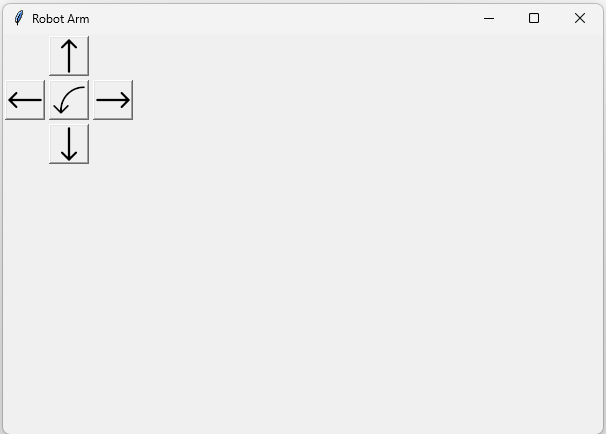

# Overview

 Robot Angular con 3 GDL controlado por medio de una interfaz grafica en Python/Tkinter y un microcontrolador ESP32 mediante motores paso a paso.
 
 
 
## Features

 El proyecto integra control directo de los motores paso a paso mediante una GUI simple ademas de una serie de funciones presentadas como botones extra para ejecutar patrones de movimiento especificos. 
 
 
 
 El robot tambien posee elementos terminales intercambeables destinados a demostrar la utilidad de los patrones de movimiento integrados en la GUI. 
 Funciones como Control de Velocidad por sensores y mecanismo complejos de transmision aun estan en contemplacion. 

## Project Structure

 * **Embedded** - Codigo embedido en C/C++ usando el framework de Arduino y su IDE

 * **Tkinter Code** - Codigo de alto nivel para la interfaz grafica y representacion visual del robot que implementa la libreria Pillow para el manejo de imagenes

 * **Pyserial Code** - Codigo que define la interfaz de comunicacion serial entre la PC y el microcontrolador implementando la libreria PySerial

 * **Schematics** - Documentacion referente a las conexiones y montaje general del hardware implementado
 
 * **CAD Models** - Referencia de modelos 3D usados para el robot.

## Prerequisites 

 * **Hardware**: 
   - Placa Espressif ESP32
   - Motores Paso a Paso
   - Cable Mini-USB
   
 * **Software**:
   - Arduino IDE
   - Python 3.13>=
   - ESP32 Arduino Core
   - Accelstepper Library
   
 * **Pip Packages**:
   - Pillow 
   - PySerial
	

## Installation/Setup

	[Bajo desarrollo]
	
## Additional Notes:

 Se tendran diversos archivos README para cada seccion mayor del repositorio. El proyecto podra tener multiples ramas dedicadas a versiones nativas y a versiones de desarrollo y master. Actualmente este repositorio solo tiene la rama de master.
